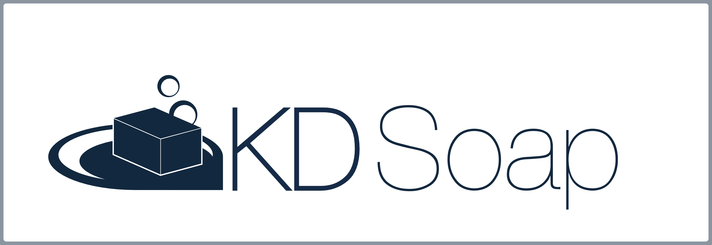
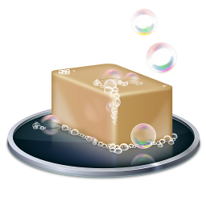

# Introduction

KD Soap is a Qt-based client-side and server-side SOAP component.

It can be used to create client applications for web services and also provides
the means to create web services without the need for any further component such
as a dedicated web server.

KD Soap targets C++ programmers who use Qt in their applications.

For more information, see <https://www.kdab.com/development-resources/qt-tools/kd-soap>

## Using KD Soap

KD Soap requires Qt 5.9.0 or newer, and a compiler with C++11 support.
Qt6 support is added starting with KD Soap version 2.0, and requires
a compiler with C++17 support.

See [INSTALL.txt](INSTALL.txt) for installation instructions using CMake.

Learn more at our:

* [online API reference](https://docs.kdab.com/kdsoap)
* [programmers manual with examples](docs/manual/kdsoap.pdf)
* [sorted example programs](examples/)

## Contact

* See our official home page: <https://www.kdab.com/development-resources/qt-tools/kd-soap>
* Visit us on GitHub: <https://github.com/KDAB/KDSoap>
* Email info@kdab.com with questions about this product.

Stay up-to-date with KDAB product announcements:

* [KDAB Newsletter](https://news.kdab.com)
* [KDAB Blogs](https://www.kdab.com/category/blogs)
* [KDAB on Twitter](https://twitter.com/KDABQt)

## Get Involved

KDAB will happily accept external contributions.

Please submit your contributions or issue reports from our GitHub space at
<https://github.com/KDAB/KDSoap>.

Thanks to our [contributors](CONTRIBUTORS.txt).

## License

The KD Soap Software is © Klarälvdalens Datakonsult AB (KDAB), and is
available under the terms of the [MIT](LICENSES/MIT.txt) license.

Contact KDAB at <info@kdab.com> for any licensing queries.

Note that this project requires the 3rd party 'libkode' submodule
that is licensed separately with LGPL-2.0-or-later; however, libkode
is used for code-generation only and the resulting code can be made
available under any license.

Various other freely distributable files are contained in the unittests
and are not used in the library code itself.

## About KDAB

KD Soap is supported and maintained by Klarälvdalens Datakonsult AB (KDAB).

The KDAB Group is the global No.1 software consultancy for Qt, C++ and
OpenGL applications across desktop, embedded and mobile platforms.

The KDAB Group provides consulting and mentoring for developing Qt applications
from scratch and in porting from all popular and legacy frameworks to Qt.
We continue to help develop parts of Qt and are one of the major contributors
to the Qt Project. We can give advanced or standard trainings anywhere
around the globe on Qt as well as C++, OpenGL, 3D and more.

Please visit <https://www.kdab.com> to meet the people who write code like this.

KD SOAP and the KD SOAP logo are registered trademarks of Klaralvdalens Datakonsult AB
in the European Union, the United States, and/or other countries.  Other product and
company names and logos may be trademarks or registered trademarks of their respective companies.
